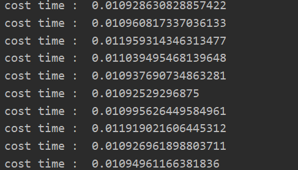

只提供demo，不提供代码。可以直接布置在docker上。J
# 需求
- tensorflow ==1.15 

- dlib 

- opencv-python 

- numpy 

- python 3 

# 训练好的模型
不会上传的git lst上，百度云盘都满了，只能传到腾讯的云盘上。下载的地址在tmp目录的txt中。
# 测试

| 功能   | acc  |      |
| ------ | ---- | ---- |
| gender | 97%  |      |
| age    | 87%  |      |

# 性能
可以同时识别多个人脸。在我的笔记本上，预测耗时如下。1060+i7.

