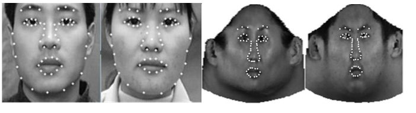
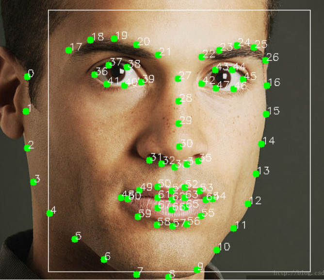

·

上面的图是一个映射图。左边2个检测到关键点，然后右边仿生映射到一个人脸模具中。如果做训练集，可以映射到一个方形图片中。

看的论文时间比较短，然后找到一个可以短时间实现的方法。下面说下步骤。

1. dlib找到人的外圈脸的关键点。
2. 通过仿生映射映射到一个人脸模具框中。
3. 然后用这个映射结果作为训练模型的数据。
4. 在使用模型时候，需要把人脸做个相同映射，然后为给model。

