# 前言 

本文提出了一种针对含有雾的图像和视频快速、完善的去雾算法。观察发现有雾的图像普遍具有低对比度，我们通过增强对比度来修复图像。然后多度的增强这些低对比度会截断像素值以及导致信息丢失。因此，我们引入一个包含对比项以及信息丢失项的损失函数。通过最小化损失函数，该算法不仅增强了对比度而且有效的保留了图像信息。另外，我们将图片去雾算法扩展到视频去雾。我们通过计算透射率的相关性减少对视频去雾时的闪烁程度。实验证明该算法去雾的有效性以及快速地进行实时去雾。

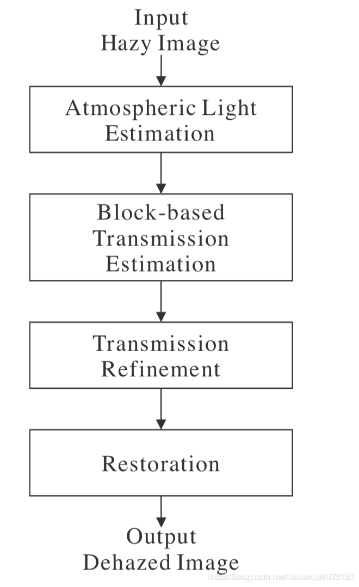

和现在一些常见的去雾文章有明显的不同的是，这篇文章的并不是基于暗通道原理的，也不是把重点强调在透射率图的细化上，而是提出了一种新的得到粗透射率图的方法。并且文章分别讲到了静态图像和视频图像的去雾。

# 图像去雾化

## 算法原理

 一般，图像去雾问题可以用一个雾形成模型来描述：

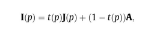

其中, Jb(p))代表原始图像(R,G,B)3个通道，

,

代表有雾的图像。A=(Ar,Ag,Ab)A=(Ar,Ag,Ab)是全球大气光值，它表示周围环境的大气光。t(p)∈[0,1]t(p)∈[0,1]是反射光的透射率, 由场景点到照相机镜头之间的距离所决定。因为光传播的距离越远，光就越分散且越发减弱。

其中

表示是像素位置

所以上面这个公式的意思就是，本来没有被雾所笼罩的图像 J 与大气光 A 按一定比例进行混合后就得到我们最终所观察到的有雾图像。

%3D\frac{I(p)-(1-t(p))A}{t(p)})

通过这个公式求出无雾图,I(p)  已知,下面就是求A和t(p).

## 第一部分 求大气雾化效果

大气光 A 通常用图像中最明亮的颜色来作为估计。因为大量的灰霾通常会导致一个发亮（发白）的颜色。具体方法如下:

> 1. 我们将图片分为四个矩形区域。
> 2. 计算该区域的得分score = 每个区域的平均像素值 - 该区域的标准差。
> 3. 将score最高的区域划分为四个小区域。
> 4. 重复2~3步骤，直到最高score区域的size小于预先设定的阈值。
> 5. 计算可以最小化距离

> 1. 的颜色向量作为大气光值A.

这一步可以做优化加速,缩放图片然后在做处理. 

## 第二部分 最优传输估计t(x)      

这是一个迭代的过程，每次增长一点，然后求出所有结果中的最优解。

对于有雾图像，其整体的对比比较低，因此去雾后的对比度要尽量的高，文中给出了三种测评一幅图像对比度的方式：

(1) Mean squared error (MSE) contrast【最终选取的t的损失函数】

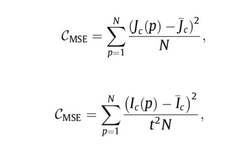

(2) Michelson contrast

经常用于周期性图案和纹理，计算最大值和最小值之间的差别。

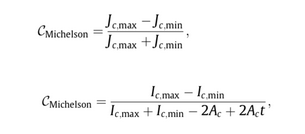

（3）Weber contrast

背景颜色和物体颜色的归一化差；经常英语人眼视觉系统。

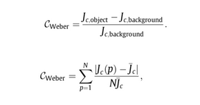

题外话,看到这里想到了什么?深度学习,对没错.如果脑洞在大点,可以做一个类似与deepid一样的模型,求解最小的误差.训练的是有雾和无雾的图片,提取特征,然后逼近.

## 第三部分 保真

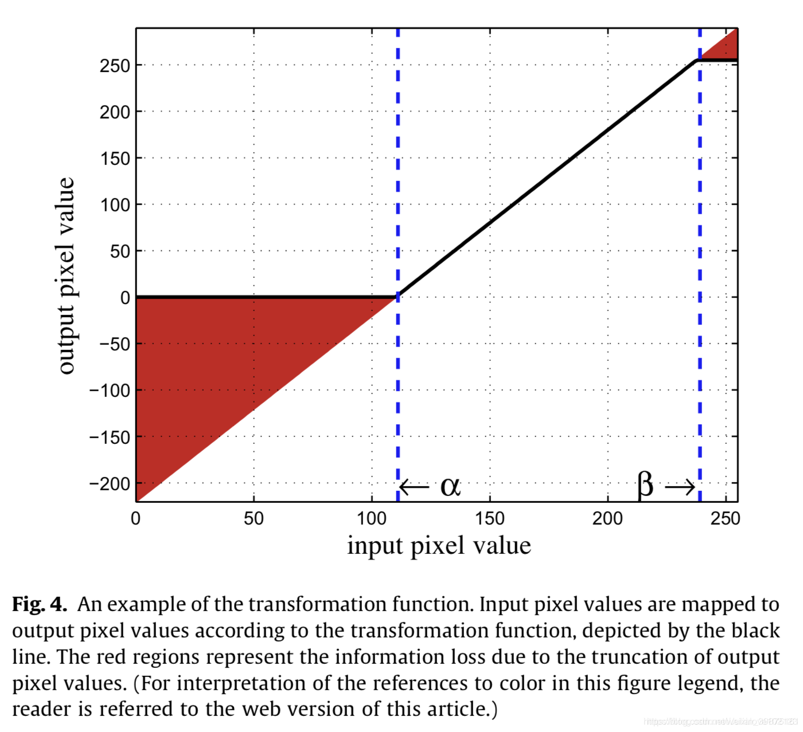

由于对比度得到增强，可能会导致部分像素的调整值超出了0和255的范围，这样就会造成信息的损失以及视觉上的瑕疵。因此提出了一个信息量损失的计算公式：

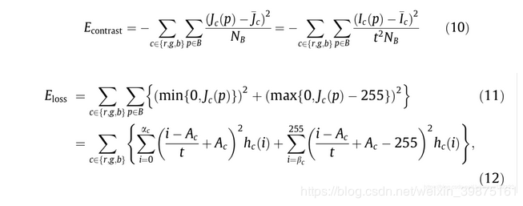

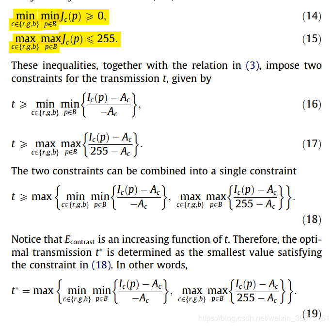

一个好的透射率图应该使得总的损失最小：

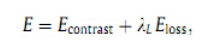

## 第四部分  导向滤波

**出现的问题（1）：由于我们的估计是基于每个块的传输值相同的假设来做的，所以会产生”块效应”。作者采用导向滤波来解决这个问题。**

假设：

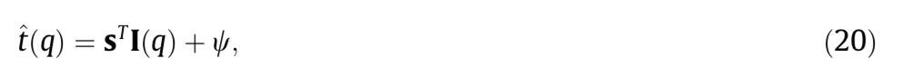 s是尺度向量，ψ 是偏移量，均由尺寸为41x41的局部窗口决定

通过计算下面的公式来获得每个窗口W的最优参数：

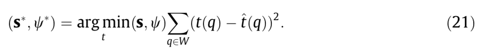

\>>>对应解决方法：centered window scheme：该窗口按像素逐次移动，每个像素的传输值取每个窗口在该像素计算出t的平均值。

出现的问题（2）：centered window scheme会产生模糊，尤其是在深度变化比较显著的物体边界。在图像久久表现为“halo现象”。

\>>>对应解决方法：shiftable window scheme，可以减少来自边缘区域的不可靠传输值的贡献，因此可以减轻模糊的伪影。

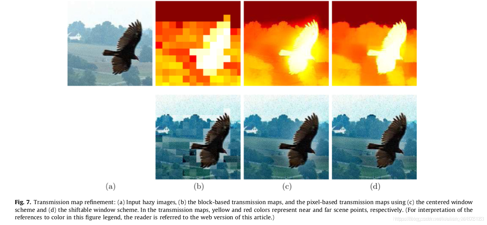

注意：

​    限制t>0.1（太小会产生噪声）；     采用gamma矫正优化去雾后图像（会有部分比原图像黑的部分）；

## 第五部分 关键的东西

论文中提到的求t的两种方法。

地一个

 

 

 

图7示出了基于块的传输图和相应的基于像素的细化图的示例。我们发现基于像素的地图有效地减少了阻塞伪影，更准确地保留了图像细节。此外，如图7（c）和（d）中所比较，与中心窗口方案（例如，在鸟的边界附近）相比，可移动窗口方案减轻了模糊伪影并提供了更可靠的传输值。

# 视频去雾

静态图像去雾破坏了视频的时间连续性，因此提出一个针对视频序列的快速且时间连续的去雾算法。

## 4.1. 时间相干Temporal coherence

物理离摄像机越近获取到的光线就更接近于原来的场景光线，越远则越接近于大气光！

在视频去雾中首先会将视频序列转换到YUV颜色空间，然后仅对luminance(Y)分量进行计算，以减少算法复杂度。

假设1：假设一个场景点在两个连续的图像帧之间的原始辐射是相同的：

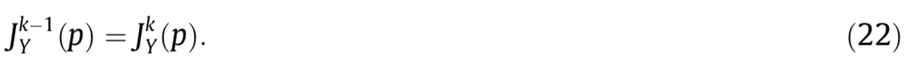

假设2：一般整个视频序列的大气光的luminance Ay是一样的，遇到环境突变的可以通过以下方式来重新估计；

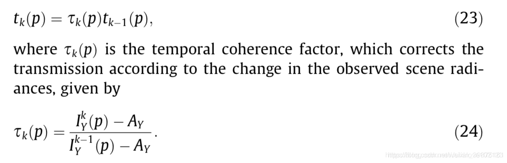

传统的motion 评估很耗时，为了省时，我们使用一个简单的概率模型，基于两帧之间的差分图像：

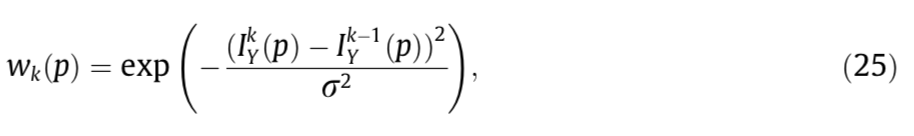

注：σ一般为10。

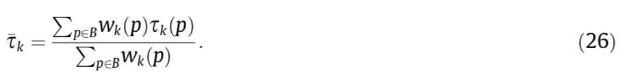

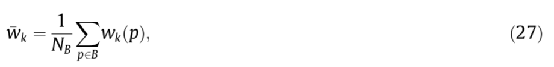

因此B block的Temporal coherence为：

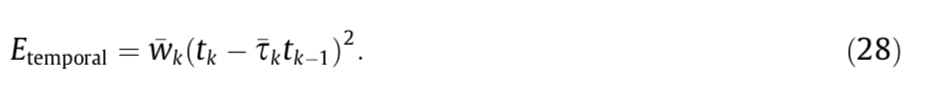

因此定义Temporal coherence的损失为：

## 4.2. 损失函数优化Cost function optimization

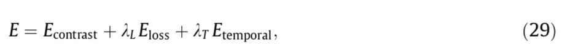

## 4.3.快速传输优化 Fast transmission refinement

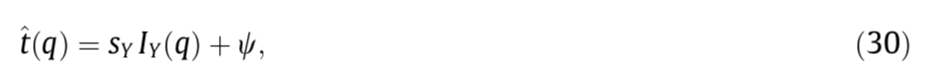

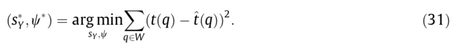

出现问题：blocking artifacts

解决的方法：Gaussian window:窗口中心周围的像素具有较高的权重，而距离中心较远的像素具有较低的权重。然后，通过计算与重叠窗口相关的传输值的高斯加权和，得到每个像素的最终最优传输值。

为了减少复杂度，方法在计算传输值的时候downsamples 一个输入图像。

# 5. 总结：

非常稳定,速度很快的算法,值得研究下.很多地方可以去优化,目前找到一次优化方案.

在这项工作中，我们提出了一种基于优化对比度增强的去嗪算法。该算法首先利用基于四叉树的细分算法对模糊图像中的大气光线进行选择。然后，由于模糊图像的对比度较低，该算法确定了适合场景深度的传输值，以提高恢复图像的对比度。然而，恢复后的图像中的一些像素可以被饱和，从而导致信息丢失。为了解决这一问题，我们将信息损失加入到优化的传输计算中。利用时间相干代价，将静态图像去雾算法扩展到实时视频去雾算法。实验结果表明，该算法能够有效地去除雾霾，很好地恢复图像，实现实时处理。