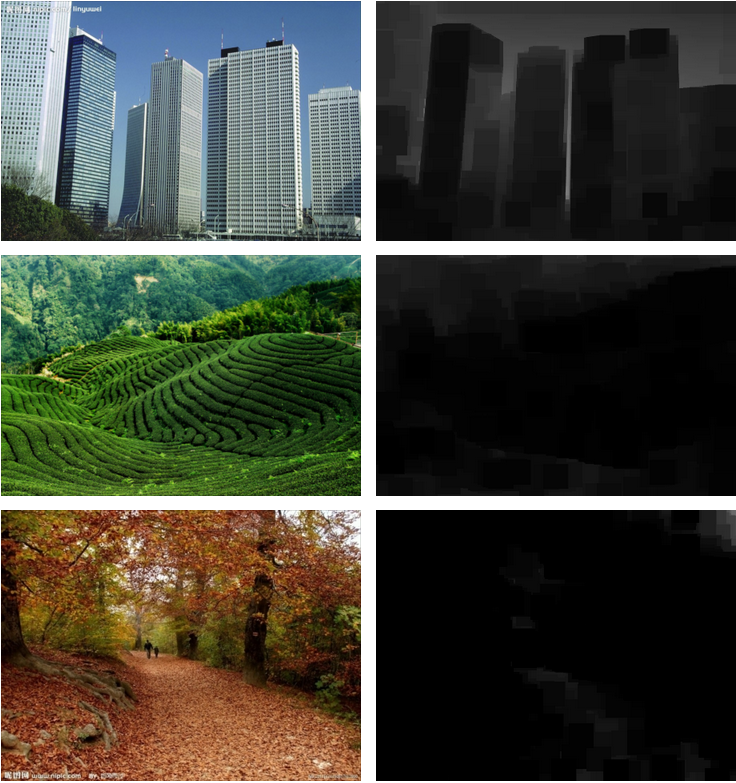

​		Single Image Haze Removal Using Dark Channel Prior, 何恺明的暗通道先验（dark channel  prior）去雾算法是CV界去雾领域很有名的算法，关于该算法的论文"Single Image Haze Removal Using Dark  Channel  Prior"一举获得2009年CVPR最佳论文。	<u>作者统计了大量的无雾图像，发现一条规律：每一幅图像的RGB三个颜色通道中，总有一个通道的灰度值很低，几乎趋向于0。基于这个几乎可以视作是定理的先验知识，作者提出暗通道先验的去雾算法。</u>

       (1)

下面说说公式推导过程

大气模型:

       (2)

$A$表示全球大气图片, $J$为无雾图像 $I$表示待去雾图像,这三个大哥都是三通道的. $t$表示折射率.

对于任意一幅输入图像，定义其暗通道的数学表达式为：

       (3)

式中$J_{c}$表示彩色图像的每个通道, $Ω_{(x)}$表示以像素X为中心的一个窗口,滤波的半径由窗口大小决定，一般有WindowSize  = 2 * Radius + 1,暗通道图像均使用的窗口大小为15*15，即最小值滤波的半径为7像素。上式表示在一幅输入图像中，先取图像中每一个像素的三通道中的最小值作为灰度值，得到一幅灰度图像. 再在这幅灰度图像中，以每一个像素为中心取一定大小的矩形窗口，取矩形窗口中灰度值最小值代替中心像素灰度值，从而得到输入图像的**暗通道图像**$J^{dark}$。暗通道图像为灰度图像，通过大量统计并观察发现，暗通道图像的灰度值是很低的，所以将整幅暗通道图像中所有像素的灰度值近似为0，就是他统计的.

> ​     实际生活中造成暗原色中低通道值主要有三个因素：
>
> - 汽车、建筑物和城市中玻璃窗户的阴影，或者是树叶、树与岩石等自然景观的投影；
>
> - 色彩鲜艳的物体或表面，在RGB的三个通道中有些通道的值很低（比如绿色的草地／树／植物，红色或黄色的花朵／叶子，或者蓝色的水面）；
>
> - 颜色较暗的物体或者表面，例如灰暗色的树干和石头。总之，自然景物中到处都是阴影或者彩色，这些景物的图像的暗原色总是很灰暗的。
>
>     
>
>     一些无雾的图片                                                                                  其暗通道

​        作者在文中假设大气光A为已知量，以便节省篇幅介绍传输函数的求解方法。**在此介绍一种简单普遍的求解大气光的方法**：对于任意一幅输入图像，取其暗通道图像灰度值最大的0.1%的像素点对应于原输入图像的像素位置的每个通道的灰度值的平均值，从而计算出每个通道的大气光值，即大气光值A是一个三元素向量，每一个元素对应于每一个颜色通道。

​       对于成像模型，将其归一化，即两边同时除以每个通道的大气光值：

       (4)

假设在图像中一定大小的矩形窗口内，传输函数的值为定值，对上式两边用最小化算子（minimum operators）作最小化运算

       (5)

 由于在矩形区域内为定值，故将其拿出运算符外部。由于场景辐射（scene radiance）是无雾图像，将暗通道先验应用于J，则有：

       (6)


由于$A^{c}$总是正值，则有：

       (7)

 将上式代入到最小化运算的式子中，即可得到传输函数的估计值为：

       (8)

为了防止去雾太过彻底，恢复出的景物不自然，应引入参数，重新定义传输函数为：

       (9)

​        对于求解得到的传输函数，应用滤波器对其进行细化，文章中介绍的方法是软抠图的方法，此方法过程复杂，速度缓慢，因此采用导向滤波对传输函数进行滤波。导向滤波的原理此处不再赘述，其伪代码为:

      

 上述伪代码中，I表示导向图像（guided image）,p为输入图像（input image）,q为输出图像（output image），表示均值滤波，r为窗口半径。

​        将求解得到的去穷远处大气光值和传输函数代入到大气散射模型之中，反解即可得到恢复的目标图像，即场景辐射。本例使用C++实现上述去雾过程，代码如下：

```
#include <iostram>
#include <stdlib.h>
#include <time.h>
#include <cmath>
#include <algorithm>
#include <opencv2\opencv.hpp>

using namespace cv;
using namespace std;

typedef struct Pixel 
{
    int x, y;
    int data;
}Pixel;

bool structCmp(const Pixel &a, const Pixel &b) 
{
    return a.data > b.data;//descending降序
}

Mat minFilter(Mat srcImage, int kernelSize);
void makeDepth32f(Mat& source, Mat& output);
void guidedFilter(Mat& source, Mat& guided_image, Mat& output, int radius, float epsilon);
Mat getTransmission_dark(Mat& srcimg, Mat& darkimg, int *array, int windowsize);
Mat recover(Mat& srcimg, Mat& t, float *array, int windowsize);

int main() 
{
    string loc = "E:\\darkchannel\\firstopencv\\sky.jpg";
    double scale = 1.0;
    string name = "forest";
    clock_t start, finish;
    double duration;

    cout << "A defog program" << endl
        << "----------------" << endl;

    Mat image = imread(loc);
    Mat resizedImage;
    int originRows = image.rows;
    int originCols = image.cols;

    if (scale < 1.0) 
    {
        resize(image, resizedImage, Size(originCols * scale, originRows * scale));
    }
    else 
    {

        scale = 1.0;
        resizedImage = image;
    }

    int rows = resizedImage.rows;
    int cols = resizedImage.cols;
    Mat convertImage;
    resizedImage.convertTo(convertImage, CV_32FC3, 1 / 255.0, 0);
    int kernelSize = 15 ? max((rows * 0.01), (cols * 0.01)) : 15 < max((rows * 0.01), (cols * 0.01));
    //int kernelSize = 15;
    int parse = kernelSize / 2;
    Mat darkChannel(rows, cols, CV_8UC1);
    Mat normalDark(rows, cols, CV_32FC1);
    int nr = rows;
    int nl = cols;
    float b, g, r;
    start = clock();
    cout << "generating dark channel image." << endl;
    if (resizedImage.isContinuous()) 
    {
        nl = nr * nl;
        nr = 1;
    }
    for (int i = 0; i < nr; i++) 
    {
        float min;
        const uchar* inData = resizedImage.ptr<uchar>(i);
        uchar* outData = darkChannel.ptr<uchar>(i);
        for (int j = 0; j < nl; j++) 
        {
            b = *inData++;
            g = *inData++;
            r = *inData++;
            min = b > g ? g : b;
            min = min > r ? r : min;
            *outData++ = min;
        }
    }
    darkChannel = minFilter(darkChannel, kernelSize);

    imshow("darkChannel", darkChannel);
    cout << "dark channel generated." << endl;

    //estimate Airlight
    //开一个结构体数组存暗通道，再sort，取最大0.1%，利用结构体内存储的原始坐标在原图中取点
    cout << "estimating airlight." << endl;
    rows = darkChannel.rows, cols = darkChannel.cols;
    int pixelTot = rows * cols * 0.001;
    int *A = new int[3];
    Pixel *toppixels, *allpixels;
    toppixels = new Pixel[pixelTot];
    allpixels = new Pixel[rows * cols];


    for (unsigned int r = 0; r < rows; r++) 
    {
        const uchar *data = darkChannel.ptr<uchar>(r);
        for (unsigned int c = 0; c < cols; c++) 
        {
            allpixels[r*cols + c].data = *data;
            allpixels[r*cols + c].x = r;
            allpixels[r*cols + c].y = c;
        }
    }
    std::sort(allpixels, allpixels + rows * cols, structCmp);

    memcpy(toppixels, allpixels, pixelTot * sizeof(Pixel));

    float A_r, A_g, A_b, avg, maximum = 0;
    int idx, idy, max_x, max_y;
    for (int i = 0; i < pixelTot; i++) 
    {
        idx = allpixels[i].x; idy = allpixels[i].y;
        const uchar *data = resizedImage.ptr<uchar>(idx);
        data += 3 * idy;
        A_b = *data++;
        A_g = *data++;
        A_r = *data++;
        //cout << A_r << " " << A_g << " " << A_b << endl;
        avg = (A_r + A_g + A_b) / 3.0;
        if (maximum < avg) 
        {
            maximum = avg;
            max_x = idx;
            max_y = idy;
        }
    }

    delete[] toppixels;
    delete[] allpixels;

    for (int i = 0; i < 3; i++) 
    {
        A[i] = resizedImage.at<Vec3b>(max_x, max_y)[i];
    }
    cout << "airlight estimated as: " << A[0] << ", " << A[1] << ", " << A[2] << endl;
    //cout << endl;

    //暗通道归一化操作（除A）
    //(I / A)
    cout << "start normalization of input image I." << endl;
    float tmp_A[3];
    tmp_A[0] = A[0] / 255.0;
    tmp_A[1] = A[1] / 255.0;
    tmp_A[2] = A[2] / 255.0;
    for (int i = 0; i < nr; i++) 
    {
        float min = 1.0;
        const float* inData = convertImage.ptr<float>(i);
        float* outData = normalDark.ptr<float>(i);
        for (int j = 0; j < nl; j++) 
        {
            b = *inData++ / tmp_A[0];
            g = *inData++ / tmp_A[1];
            r = *inData++ / tmp_A[2];
            min = b > g ? g : b;
            min = min > r ? r : min;
            *outData++ = min;
        }
    }
    cout << "normalization finished." << endl << "generating relative dark channel image." << endl;
    //暗通道最小滤波
    normalDark = minFilter(normalDark, kernelSize);
    cout << "dark channel image generated." << "start estimating transmission and guided image filtering." << endl;
    imshow("normal", normalDark);
    int kernelSizeTrans = std::max(3, kernelSize);
    //求t与将t进行导向滤波

    Mat trans = getTransmission_dark(convertImage, normalDark, A, kernelSizeTrans);
    cout << "tansmission estimated and guided filtered." << endl;
    imshow("filtered t", trans);
    cout << "start recovering." << endl;
    Mat finalImage = recover(convertImage, trans, tmp_A, kernelSize);
    cout << "recovering finished." << endl;
    Mat resizedFinal;
    if (scale < 1.0) 
    {
        resize(finalImage, resizedFinal, Size(originCols, originRows));
        imshow("final", resizedFinal);
    }
    else 
    {
        imshow("final", finalImage);
    }
    finish = clock();
    duration = (double)(finish - start);
    cout << "defog used " << duration << "ms time;" << endl;
    waitKey(0);

    finalImage.convertTo(finalImage, CV_8UC3, 255);
    imwrite(name + "_refined.png", finalImage);
    destroyAllWindows();
    image.release();
    resizedImage.release();
    convertImage.release();
    darkChannel.release();
    trans.release();
    finalImage.release();
    return 0;
}

Mat minFilter(Mat srcImage, int kernelSize) 
{
    int radius = kernelSize / 2;

    int srcType = srcImage.type();
    int targetType = 0;
    if (srcType % 8 == 0) 
    {
        targetType = 0;
    }
    else 
    {
        targetType = 5;
    }
    Mat ret(srcImage.rows, srcImage.cols, targetType);
    Mat parseImage;
    copyMakeBorder(srcImage, parseImage, radius, radius, radius, radius, BORDER_REPLICATE);
    for (unsigned int r = 0; r < srcImage.rows; r++) 
    {
        float *fOutData = ret.ptr<float>(r);
        uchar *uOutData = ret.ptr<uchar>(r);
        for (unsigned int c = 0; c < srcImage.cols; c++) 
        {
            Rect ROI(c, r, kernelSize, kernelSize);
            Mat imageROI = parseImage(ROI);
            double minValue = 0, maxValue = 0;
            Point minPt, maxPt;
            minMaxLoc(imageROI, &minValue, &maxValue, &minPt, &maxPt);
            if (!targetType) 
            {
                *uOutData++ = (uchar)minValue;
                continue;
            }
            *fOutData++ = minValue;
        }
    }
    return ret;
}

void makeDepth32f(Mat& source, Mat& output)
{
    if ((source.depth() != CV_32F) > FLT_EPSILON)
        source.convertTo(output, CV_32F);
    else
        output = source;
}

void guidedFilter(Mat& source, Mat& guided_image, Mat& output, int radius, float epsilon)
{
    CV_Assert(radius >= 2 && epsilon > 0);
    CV_Assert(source.data != NULL && source.channels() == 1);
    CV_Assert(guided_image.channels() == 1);
    CV_Assert(source.rows == guided_image.rows && source.cols == guided_image.cols);

    Mat guided;
    if (guided_image.data == source.data)
    {
        //make a copy
        guided_image.copyTo(guided);
    }
    else
    {
        guided = guided_image;
    }

    //将输入扩展为32位浮点型，以便以后做乘法
    Mat source_32f, guided_32f;
    makeDepth32f(source, source_32f);
    makeDepth32f(guided, guided_32f);

    //计算I*p和I*I
    Mat mat_Ip, mat_I2;
    multiply(guided_32f, source_32f, mat_Ip);
    multiply(guided_32f, guided_32f, mat_I2);

    //计算各种均值
    Mat mean_p, mean_I, mean_Ip, mean_I2;
    Size win_size(2 * radius + 1, 2 * radius + 1);
    boxFilter(source_32f, mean_p, CV_32F, win_size);
    boxFilter(guided_32f, mean_I, CV_32F, win_size);
    boxFilter(mat_Ip, mean_Ip, CV_32F, win_size);
    boxFilter(mat_I2, mean_I2, CV_32F, win_size);

    //计算Ip的协方差和I的方差
    Mat cov_Ip = mean_Ip - mean_I.mul(mean_p);
    Mat var_I = mean_I2 - mean_I.mul(mean_I);
    var_I += epsilon;

    //求a和b
    Mat a, b;
    divide(cov_Ip, var_I, a);
    b = mean_p - a.mul(mean_I);

    //对包含像素i的所有a、b做平均
    Mat mean_a, mean_b;
    boxFilter(a, mean_a, CV_32F, win_size);
    boxFilter(b, mean_b, CV_32F, win_size);

    //计算输出 (depth == CV_32F)
    output = mean_a.mul(guided_32f) + mean_b;
}

Mat getTransmission_dark(Mat& srcimg, Mat& darkimg, int *array, int windowsize)
{
    //t = 1 - omega * minfilt(I / A);
    float avg_A;
    //convertImage是一个CV_32FC3的图
    if (srcimg.type() % 8 == 0) {
        avg_A = (array[0] + array[1] + array[2]) / 3.0;
    }
    else {
        avg_A = (array[0] + array[1] + array[2]) / (3.0 * 255.0);
    }
    float w = 0.95;
    int radius = windowsize / 2;
    int nr = srcimg.rows, nl = srcimg.cols;
    Mat transmission(nr, nl, CV_32FC1);

    for (int k = 0; k<nr; k++) 
    {
        const float* inData = darkimg.ptr<float>(k);
        float* outData = transmission.ptr<float>(k);
        float pix[3] = { 0 };
        for (int l = 0; l<nl; l++)
        {
            *outData++ = 1.0 - w * *inData++;
        }
    }
    imshow("t", transmission);

    Mat trans(nr, nl, CV_32FC1);
    Mat graymat(nr, nl, CV_8UC1);
    Mat graymat_32F(nr, nl, CV_32FC1);

    if (srcimg.type() % 8 != 0) 
    {
        cvtColor(srcimg, graymat_32F, CV_BGR2GRAY);
        guidedFilter(transmission, graymat_32F, trans, 6 * windowsize, 0.001);
    }
    else 
    {
        cvtColor(srcimg, graymat, CV_BGR2GRAY);

        for (int i = 0; i < nr; i++) 
        {
            const uchar* inData = graymat.ptr<uchar>(i);
            float* outData = graymat_32F.ptr<float>(i);
            for (int j = 0; j < nl; j++)
                *outData++ = *inData++ / 255.0;
        }
        guidedFilter(transmission, graymat_32F, trans, 6 * windowsize, 0.001);
    }
    return trans;
}

Mat recover(Mat& srcimg, Mat& t, float *array, int windowsize)
{
    //J(x) = (I(x) - A) / max(t(x), t0) + A;
    int radius = windowsize / 2;
    int nr = srcimg.rows, nl = srcimg.cols;
    float tnow = t.at<float>(0, 0);
    float t0 = 0.1;
    Mat finalimg = Mat::zeros(nr, nl, CV_32FC3);
    float val = 0;

    //Be aware that transmission is a grey image
    //srcImg is a color image
    //finalImg is a color image
    //Mat store color image a pixel per 3 position
    //store grey image a pixel per 1 position
    for (unsigned int r = 0; r < nr; r++) {
        const float* transPtr = t.ptr<float>(r);
        const float* srcPtr = srcimg.ptr<float>(r);
        float* outPtr = finalimg.ptr<float>(r);
        for (unsigned int c = 0; c < nl; c++) {
            //transmission image is grey, so only need 
            //to move once per calculation, using index 
            //c(a.k.a. columns) to move is enough 
            tnow = *transPtr++;
            tnow = std::max(tnow, t0);
            for (int i = 0; i < 3; i++) {
                //so to calculate every color channel per pixel
                //move the ptr once after one calculation.
                //after 3 times move, calculation for a pixel is done
                val = (*srcPtr++ - array[i]) / tnow + array[i];
                *outPtr++ = val + 10 / 255.0;
            }
        }
    }
    cout << finalimg.size() << endl;
    return finalimg;
}
```

[](javascript:void(0);)

​        运行代码的测试结果为：


​         可以很明显地观察到，所选素材中含有大量的天空区域。利用暗通道先验规律对含有大量天空区域的素材作暗通道图像运算时，会发现天空区域的暗通道的灰度值并非趋向于零，因此造成在天空区域的传输函数估计值很低，造成错误。为了弥补这个错误，作者对传输函数的值设定了一个下界，这个下界通常取0.1，然而设定这个下界后，会发现天空区域如上述去雾后的结果那样出现光圈（halo）效应，天空部分的去雾效果很不自然。这也是暗通道先验去雾算法的劣处所在。

​          

 

​         基于暗通道先验的去雾算法所得到的去雾结果令人惊叹，其理论过程简单易行，至今仍是去雾领域的经典算法。近年来，许多学者对该算法不断从技术上改进，也有学者试图从别的角度解释暗通道先验规律的成立原因，下面从几何的角度解释暗通道先验去雾算法之所以成立的原因。为了与先前介绍的暗通道先验算法中的符号区分，接下来的文中出现的特定的符号的意义如下：表示图像中特定大小的矩阵窗口内的像素集合；表示将对应于中的像素的灰度值在RGB空间中表示的坐标的集合。

​       本例介绍的论文为“Single Image Dehazing Using Color Ellipsoid Prior”，作者在这篇文章中介绍了暗通道先验去雾算法的几何数学解释过程。


   无论是何种去雾方法，将去雾前后图像的同一片区域投射在RGB坐标空间中，形成如上图所示的点坐标的分布。将去雾前的坐标和去雾后的坐标相连，形成RGB空间的向量，将不同的去雾方法对应得到的向量定义为先验向量(prior   vector)。上图中，通过先验向量P去雾扩大的无雾坐标分布要比Q扩大的要小，这意味着通过先验向量P去雾得到的结果保持了饱和度，却丧失了对比度。反之，通过先验向量Q去雾得到的结果保持了对比度，却产生了过度饱和的现象,所以通过先验向量Q的去雾结果中的树叶部分出现黑点(dark  spots)。所有的去雾算法归结为设定合适的先验向量，求解合适的传输函数，满足：尽可能地增大图像对比度，同时抑制过度饱和。

         上图表示雾天图像两个相近区域的像素灰度值分布情况，其中一区域不含有不规则像素值(irregular pixel  values)，另一区域含有不规则像素值。不规则像素值的分布是零星的，两个区域的大部分像素值的分布区域几乎一致，所以两个区域的去雾结果大体是相同的。然而在选取先验向量时，若从不规则像素值区域选取的话，则会产生很大的误差，因此设计的先验向量应该具有数据鲁棒性(statistically  robust)以克服不规则像素值的干扰。

 

​          如上图所示，雾天图像的局部区域中含有树叶部分和背景部分，树叶部分和背景部分的像素灰度值的RGB空间中如图所示标出。在两个部分的边缘地带，有大量的像素灰度值是由两个区域混合的，这就造成选取混合区域的先验向量进行去雾时，会在边缘地带造成光圈效应(halo  effect)。后续算法会解释如何去除这种光圈效应。

​           下面介绍颜色椭球先验(color ellipsoid  prior)：在RGB三维空间中，含雾图像的向量往往聚集在一起并有序的排列着。在三维空间中，向量可以用空间中的坐标表示，所以向量和颜色空间中的点是等价的。向量聚集区域可以统计地看做是一个椭球，椭球的形状由向量的聚集状态决定。这种方法的缺点是无法统计随意分布的向量区域。

 


   如图（a）所示，其为图像区域对应的向量分布区域的示意图；如图（b）所示，其为图像区域对应的向量分布区域的示意图。前者为没有随机分布点的规则椭球向量分布，后者是含有不规则向量的椭球向量分布，但是两者可以视为同等椭球向量分布。

​       现在根据椭球模型构造数学表达式，设为RGB空间的向量变量，对应于图像中像素区域（i为序数标记）的向量椭球区域可以表示为：

        (10)

 其中，表示输入图像在区域内的灰度值的均值对应的向量，其表达式为：

       (11)

其中为输入图像的归一化像素值，为三维向量。为无穷远处的大气光值，此处假设其已知：

       (12)

方差定义为：

       (13)

在RGB空间中，均值决定了球的中心位置，方差决定了球的方向和大小。

​         上述各式为椭球模型的基本定义的参量，现在分析CEP值和传输函数的计算过程。文中有一段文字“The proposed method  calculates the vector having the smallest color component among the  vectors in the ellipsoid  to  maximally stretch the hazy vector cluster while preventing the color  components of the majority of streched vectors from being negative”,这段话的意思是，通过先验向量将原来的含雾图像的像素灰度值分布的椭球拉伸映射到灰度值很低的椭球中（无雾图像的像素灰度值相对于原雾天图像是比较低的）。故在设计合适的先验向量和先验值（本例中为CEP值）去雾时，应满足如前所述的条件。通过对大气散射模型反解，可以得到目标辐射景象为：

       (14)

为了使得去雾图像，即目标辐射场景的灰度值尽可能低，则传输函数的值应该尽可能地大，又因为传输函数与先验值的关系为，所以先验值应该尽可能地小。所以本例中定义的先验值，即CEP值的数学表达式为：

       (15)

该式表示，在椭球中的每一个向量取其三颜色通道分量的最小值，再取这些最小值当中的最小值作为CEP值（这与暗通道先验规律具有一致性）。

​       下面从几何的角度求解CEP值：首先定义三个坐标轴的单位向量，，分别为：，，；将定义为和单位向量垂直且通过坐标原点的平面；如此，则为向量的R，G，B某一分量的值，并且该数值表示向量对应于空间中的坐标（即在椭球面上或者椭球内的点）到平面的距离；设为使得距离最小的向量，即：

       (16)

之所以有标记c，是因为表示椭球面上或椭球内部中到平面距离最小的点对应的向量，中的c的取值有三个：，所以对应的中c的取值也有三个且和中c的取值已知，分别为，，，三者分别表示椭球中到，，平面距离最小的点坐标对应的向量。


​         如上所示的（a）,（b），（c）分别为，，对应在空间中的坐标点和其到平面，，的距离的示意图。容易观察到，到三个平面距离最近的点均在椭球面上，且在点处椭球的切面与对应的平面平行。由于点在椭球面上，则满足表达式：

       (17)

上式表示点在以为中心，为半径的椭球面上。则关于CEP值，有如下推导：

       (18)

 由于点处椭球的切面与对应的平面平行，所以在点出的外单位法向量（outward normal vector）为上图所示的。根据文中所述定理：The  gradient direction of a vector on the ellipse surface is perpendicular  to the tangent plane,and so the outward normal vector must have the same  direction as the gradient of the ellipse  surface，即在球面处的点的梯度方向和在该点处的切平面垂直，在该点处的外单位法向量和梯度方向是一致的。根据该定理，可得下式：

        (19)

其中，梯度部分的计算过程为：

       (20)

则有：

       (21)

所以有：

       (22)

其中，。由此重新表达为：

       (23)

所以中的向量到平面距离最小值为：

       (24)

所以，CEP值的表达式为：

       (25)

故对应的传输函数的表达式为：

       (26)

​        下面根据上述推导过程介绍如何设计算法，设是使得CEP值在三通道中最小的那一通道，即：

       (27)

则传输函数可以重新表示为：

       (28)

若直接计算每一点邻域矩形的均值与方差的差值，再取三通道中的最小值较为繁琐，作者提出一种近似方法，利用这种近似方法与原原本本的计算结果相差无几，但是大大提高了速度和效率。近似方法为：

       (29)

其中，表示输入雾天图像在像素点j处c通道的灰度值。

​       设大气光已知，按照上述过程计算每一像素点处的均值和方差，并将其代入传输函数公式中以计算传输函数，由此即可恢复目标图像，处理结果为：


上述结果在边缘部分出现了很模糊的现象，这是由于在选择椭球区域时，所选区域的像素梯度过大，某一点的像素灰度值与其周围像素的灰度值差别很大。因此有必要对求取的传输函数进行细化，作者分别对均值和方差进行细化（即滤波）：对于均值部分，作者采用了与导向滤波十分类似的滤波器，但不完全是导向滤波，因为滤波过程中无导向图像（guided  image）；对于方差部分，作者采用了均值滤波。滤波过程的伪代码如下：

 

 

​       用MATLAB对上述伪代码的仿真为：

[](javascript:void(0);)[](javascript:void(0);)[](javascript:void(0);)

```
clear all;
I=imread('E:\picture\t.bmp');
I=double(I);
I=I./255;
dark=darkfunction(I);
[m,n,o]=size(I);
imsize=m*n;
numpx=floor(imsize/1000);
J_dark_vec=reshape(dark,imsize,1);
I_vec=reshape(I,imsize,3);
[J_dark_vec,indices]=sort(J_dark_vec);
indices=indices(imsize-numpx+1:end);
atmSum=zeros(1,3);
for ind=1:numpx
    atmSum=atmSum+I_vec(indices(ind),:);
end;
atmospheric=atmSum/numpx;
A=atmospheric;

omega=0.95;
r=10;epsilon=0.002;
epsilon=(1/mean(A))^2*epsilon;
R=I(:,:,1)/A(1);G=I(:,:,2)/A(2);B=I(:,:,3)/A(3);
Imin=min(min(R,G),B);

N=boxfilter(ones(m,n),r);
u_m=boxfilter(Imin,r)./N;
%对均值滤波，与导向滤波相似，但不是导向滤波
u_mm=boxfilter(Imin.*Imin,r)./N;
sigma_m=u_mm-u_m.*u_m;
a=sigma_m./(sigma_m+epsilon);
b=(1-a).*u_m;
u_a=boxfilter(a,r)./N;
u_b=boxfilter(b,r)./N;
u_m=u_a.*Imin+u_b;

sigma_mm=boxfilter((Imin-u_m).*(Imin-u_m),r)./N;
%对方差滤波，此处为均值滤波，也可仿上述滤波过程进行滤波
sigma_mm=boxfilter(sigma_mm,r)./N;

t=1-omega*(u_m-sqrt(abs(sigma_mm)));

for i=1:m
    for j=1:n
        for k=1:3
            I(i,j,k)=(I(i,j,k)-A(k))/max(t(i,j),0.1)+A(k);
        end;
    end;
end;
imshow(I);

function [dark] =darkfunction(I)
R=I(:,:,1);
G=I(:,:,2);
B=I(:,:,3);
[m,n]=size(R);
a=zeros(m,n);
for i=1:m
    for j=1:n
        a(i,j)=min(R(i,j),G(i,j));
        a(i,j)=min(a(i,j),B(i,j));
    end;
end;
d=ones(15,15);
fun=@(block_struct)min(min(block_struct.data))*d;
dark=blockproc(a,[15,15],fun);
dark=dark(1:m,1:n);
end

function [J] = boxfilter(I,r)
[m,n]=size(I);
J=zeros(size(I));
Icum=cumsum(I,1);
J(1:r+1,:)=Icum(r+1:2*r+1,:);
J(r+2:m-r,:)=Icum(2*r+2:m,:)-Icum(1:m-2*r-1,:);
J(m-r+1:m,:)=repmat(Icum(m,:),[r,1])-Icum(m-2*r:m-r-1,:);
Icum=cumsum(J,2);
J(:,1:r+1)=Icum(:,r+1:2*r+1);
J(:,r+2:n-r)=Icum(:,2*r+2:n)-Icum(:,1:n-2*r-1);
J(:,n-r+1:n)=repmat(Icum(:,n),[1,r])-Icum(:,n-2*r:n-r-1);
end
```

​        用C++实现算法为：


```
#include <iostream>
#include <stdlib.h>
#include <time.h>
#include <cmath>
#include <algorithm>

#include <opencv2\opencv.hpp>
#include <opencv2\imgproc\imgproc.hpp>
#include <opencv2\highgui\highgui.hpp>

using namespace std;
using namespace cv;

int main()
{
    Mat GF_smooth(Mat& src, int s, double epsilon);
    Mat staticMin(Mat& I, int s, double eeps, double alpha);
    int est_air(Mat& src, int s, double *A_r, double *A_g, double *A_b);
    Mat est_trans_fast(Mat& src, int s, double eeps, double k, double A_r, double A_g, double A_b);
    Mat rmv_haze(Mat& src, Mat& t, double A_r, double A_g, double A_b);

    string loc = "E:\\sphere\\firstopencv\\t.bmp";
    string name = "forest";
    clock_t start, finish;
    double duration;

    cout << "A defog program" << endl
         << "---------------" << endl;

    start = clock();
        Mat image = imread(loc);
    imshow("hazyimage", image);
    cout << "input hazy image" << endl;
    
    int s = 15;
    double eeps = 0.002, omega = 0.95;
    double air_r, air_g, air_b;
    est_air(image, s, &air_r, &air_g, &air_b);
    cout << "airlight estimation as:" << air_r << ", " << air_g << ", " << air_b << endl;

    Mat t;
    t=est_trans_fast(image, s, eeps, omega, air_r, air_g, air_b);

    Mat dehazedimage;
    dehazedimage = rmv_haze(image, t, air_r, air_g, air_b);
    imshow("dehaze", dehazedimage);
    finish = clock();
    duration = (double)(finish - start);
    cout << "defog used" << duration << "ms time;" << endl;
    waitKey(0);

    imwrite(name + "_refined.png", dehazedimage);
    destroyAllWindows();
    image.release();
    dehazedimage.release();
    return 0;
}

//---------------------- GUIDED FILTER -------------------//
Mat GF_smooth(Mat& src, int s, double epsilon)
{
    src.convertTo(src, CV_64FC1);

    Mat mean_I;
    blur(src, mean_I, Size(s, s), Point(-1, -1));

    Mat II = src.mul(src);
    Mat var_I;
    blur(II, var_I, Size(s, s), Point(-1, -1));
    var_I = var_I - mean_I.mul(mean_I);

    Mat a = var_I / ((var_I + epsilon));
    Mat b = mean_I - a.mul(mean_I);

    Mat mean_a;
    blur(a, mean_a, Size(s, s), Point(-1, -1));
    Mat mean_b;
    blur(b, mean_b, Size(s, s), Point(-1, -1));

    return mean_a.mul(src) + mean_b;
}


Mat staticMin(Mat& I, int s, double eps, double alpha)
{
    Mat mean_I = GF_smooth(I, s, eps);

    Mat var_I;
    blur((I - mean_I).mul(I - mean_I), var_I, Size(s, s), Point(-1, -1));

    Mat mean_var_I;
    blur(var_I, mean_var_I, Size(s, s), Point(-1, -1));

    Mat z_I;
    sqrt(mean_var_I, z_I);

    return mean_I - alpha*z_I;
}


//---------------------- DEHAZING FUNCTIONS -------------------//
int est_air(Mat& src, int s, double *A_r, double *A_g, double *A_b)
    {
        /// Split RGB to channels
        src.convertTo(src, CV_64FC3);
        vector<Mat> channels(3);
        split(src, channels);        // separate color channels

        Mat R = channels[2];
        Mat G = channels[1];
        Mat B = channels[0];

        Mat Im = min(min(R, G), B);

        /// Estimate airlight
        Mat blur_Im;
        blur(Im, blur_Im, Size(s, s), Point(-1, -1));

        int maxIdx[2] = { 0, 0 };
        minMaxIdx(blur_Im, NULL, NULL, NULL, maxIdx);

        int width = R.cols;
        *A_r = ((double*)R.data)[maxIdx[0] * R.cols + maxIdx[1]];
        *A_g = ((double*)G.data)[maxIdx[0] * R.cols + maxIdx[1]];
        *A_b = ((double*)B.data)[maxIdx[0] * R.cols + maxIdx[1]];

        return 0;
    }

    Mat est_trans_fast(Mat& src, int s, double eeps, double k, double A_r, double A_g, double A_b)
    {
        /// Split RGB to channels
        src.convertTo(src, CV_64FC3);
        vector<Mat> channels(3);
        split(src, channels);        // separate color channels

        Mat R = channels[2];
        Mat G = channels[1];
        Mat B = channels[0];

        /// Estimate transmission
        Mat R_n = R / A_r;
        Mat G_n = G / A_g;
        Mat B_n = B / A_b;

        Mat Im = min(min(R_n, G_n), B_n);

        eeps = (3 * 255 / (A_r + A_g + A_b))*(3 * 255 / (A_r + A_g + A_b))*eeps;
        double alpha = 2;
        Mat z_Im = staticMin(Im, s, eeps, alpha);

        return min(max(0.001, 1 - k*z_Im), 1);
    }


    Mat rmv_haze(Mat& src, Mat& t, double A_r, double A_g, double A_b)
    {
        /// Split RGB to channels
        src.convertTo(src, CV_64FC3);
        vector<Mat> channels(3);
        split(src, channels);        // separate color channels

        Mat R = channels[2];
        Mat G = channels[1];
        Mat B = channels[0];

        /// Remove haze
        channels[2] = (R - A_r) / t + A_r;
        channels[1] = (G - A_g) / t + A_g;
        channels[0] = (B - A_b) / t + A_b;

        Mat dst;
        merge(channels, dst);

        dst.convertTo(dst, CV_8UC3);
        return dst;
    }
```

​        用MATLAB或者C++运行的实验结果为：


​        结果分析：通过该实验结果发现，颜色椭球先验（CEP）的去雾算法的运行结果和暗通道先验（DCP）算法的运行结果基本上是一致的，这也验证了CEP是DCP在几何上的解释，两者具有内在一致性，在本质上是相同的。但是，两者也有细微的差别。由于两种算法的实现结果一致，不好比较，现在将两者在传输函数优化之前的去雾效果进行比较，下图为DCP所求的传输函数在导向滤波之前的去雾效果：


下图为CEP所求传输函数在滤波优化前的去雾效果：


很明显地观察到：DCP的边缘效应比CEP的边缘效应更明显一些，说明基于CEP计算的传输函数要比基于DCP计算的传输函数更精确一些。这也体现了文章中所说的，与之前的DCP相比较，CEP去雾效果更具有数据鲁棒性（statistically robust）。