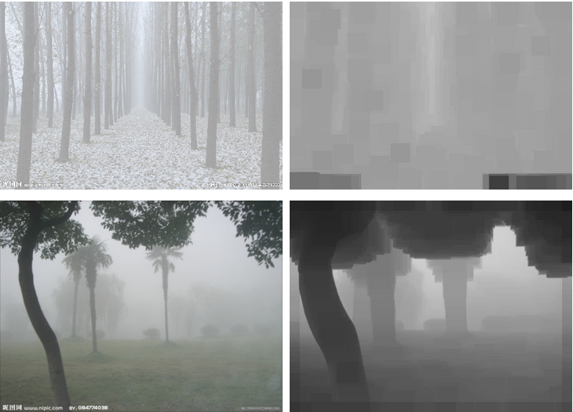

Single Image Haze Removal Using Dark Channel Prior

​     在图像去雾这个领域，几乎没有人不知道《[Single Image Haze Removal Using Dark Channel Prior](http://files.cnblogs.com/Imageshop/SingleImageHazeRemovalUsingDarkChannelPrior.rar)》这篇文章，作者何凯明博士，2007年清华大学毕业，2011年香港中文大学博士毕业。

​     关于何博士的一些资料和论文，大家可以访问这里：http://research.microsoft.com/en-us/um/people/kahe/

另外一篇文章《[Guided Image Filtering](http://research.microsoft.com/en-us/um/people/kahe/eccv10/index.html)》 ，其中提到了可以用导向滤波来代替soft matting的过程，且速度很快，因此，我对去雾的兴趣算法又大大提高了。  

# **一、论文思想的简单描述** 

​		首先看看暗通道先验是什么：dc_img

​		在绝大多数非天空的局部区域里，某一些像素总会有至少一个颜色通道具有很低的值。换言之，该区域光强度的最小值是个很小的数。

​      dc_img先验的理论指出：滤波的半径由窗口大小决定，一般有$WindowSize  = 2 * Radius + 1$;          

在看看一些有雾的图的暗通道：

      

　　　　　　　　　　一些有雾的图片                                                                                  其暗通道

　　

​      由上述几幅图像，可以明显的看到暗通道先验理论的普遍性。在作者的论文中，统计了5000多副图像的特征，也都基本符合这个先验，因此，我们可以认为其实一条定理。

​      有了这个先验，接着就需要进行一些数学方面的推导来最终解决问题。

​		首先，在计算机视觉和计算机图形中，下述方程所描述的雾图形成模型被广泛使用：

​                                                   

  　其中，I(X)就是我们现在已经有的图像（待去雾的图像），J(x)是我们要恢复的无雾的图像，A是全球大气光成分， t(x)为透射率。现在的已知条件就是I(X)，要求目标值J(x),显然，这是个有无数解的方程，因此，就需要一些先验了。

　　将式（1）稍作处理，变形为下式：

​                                                    

​    如上所述，上标C表示R/G/B三个通道的意思。

​    首先假设在每一个窗口内透射率t(x)为常数，定义他为，并且A值已经给定，然后对式（7）两边求两次最小值运算，得到下式：

​                                  

​    上式中，J是待求的无雾的图像，根据前述的暗原色先验理论有：

​                                               

​     因此，可推导出：

​                                                         

​    把式（10）带入式（8）中，得到：

​                                                 

​    这就是透射率的预估值。

​     在现实生活中，即使是晴天白云，空气中也存在着一些颗粒，因此，看远处的物体还是能感觉到雾的影响，另外，雾的存在让人类感到景深的存在，因此，有必要在去雾的时候保留一定程度的雾，这可以通过在式（11）中引入一个在[0,1]  之间的因子，则式（11）修正为：

​                                               

​     本文中所有的测试结果依赖于：  ω=0.95。

​     上述推论中都是假设全球达气光A值时已知的，在实际中，我们可以借助于暗通道图来从有雾图像中获取该值。具体步骤如下：

​    　　1） 从暗通道图中按照亮度的大小取前0.1%的像素。

​          2） 在这些位置中，在原始有雾图像I中寻找对应的具有最高亮度的点的值，作为A值。

​     到这一步，我们就可以进行无雾图像的恢复了。由式（1）可知：  J = ( I - A)/t + A  

​     现在I,A,t都已经求得了，因此，完全可以进行J的计算。

​     当投射图t 的值很小时，会导致J的值偏大，从而使淂图像整体向白场过度，因此一般可设置一阈值T0，当t值小于T0时，令t=T0，本文中所有效果图均以T0=0.1为标准计算。

​     因此，最终的恢复公式如下：

　                              　

​     当直接用上述理论进行恢复时，去雾的效果其实也是很明显的，比如下面一些例子：

       

       

　　　　　　　　　　       有雾图　　　　　　　　　　　　　　　　　　　　　　　　　　　　                　去雾图

​      注意到第一幅图的原图两个字的周围明显有一块不协调的地方，而第二图顶部水平方向似乎有一块没有进行去雾处理，这些都是由于我们的透射率图过于粗糙了。

​      要获得更为精细的透射率图，何博士在文章中提出了了soft  matting方法，能得到非常细腻的结果。但是他的一个致命的弱点就是速度特慢，不使用于实际使用。在2011年，何博士又除了一片论文，其中提到了导向滤波的方式来获得较好的透射率图。该方法的主要过程集中于简单的方框模糊，而方框模糊有多重和半径无关的快速算法。因此，算法的实用性特强，关于这个导向滤波算法大家在何博士的网站可以自己去研习下，除了在去雾方面外，还有着其他多方面的应用，这部分本文不多述。

​     使用了导向滤波后的去雾效果：

     

      

　　　　　　    　　使用原始的预估透射率图　　　　　　　　　　　　　　　　　　　　　            使用导向滤波后的透射率图

      

　　　　　　　　　　   　　(a) 原图　　　　　　　　　　　　　　　　　　　　　　　　　　　　    　　(b)　　去雾结果图

      

　　　　　　　　        （c）    暗通道图　　　　　　　　　　　　　　　　　　　　　　　　　　（d） 导向图 （原始图像的灰度图）

      

　　　　　　          （e)   预估透射率图　　　　　　　　　　　　　　　　　　　　　　　(f)   使用导向滤波后的透射率图

　 二、各参数对去雾结果的影响

　 第一：窗口的大小。这个对结果来说是个关键的参数，窗口越大，其包含暗通道的概率越大，暗通道也就越黑。我们不去从理论角度分析，从实践的效果来看，似乎窗口越大，去雾的效果越不明显，如下图所示：

        

​                          　　　 (a) 原始图像  　　　　　　　　　　　　　　　　　　　　　　　　　　(b) 窗口大小=11

      

　　　　　　　　　　　　　 (c) 窗口大小=21　　　　　　　　　　　　　　　　　　　　　　　　　(d) 窗口大小=101 

　　我的建议是窗口大小在11-51之间，即半径在5-25之间。

​     式（12）中的ω具有着明显的意义，其值越小，去雾效果越不明显，举例如下：

      

​                                    (a) 原始图像  　　　　　　　　　　　　　　　　　　　　　　　　　　       (b)    ω=0.5         

          

 　                                     (c)    ω=0.8                                                                   　   (d)    ω=1 

​    三：编码的步骤

　　如果你仔细的分析了原文的细路，加上适当的参考，编码其实并不是很困难。

　　1）根据原始图像求暗通道，参考代码如下：

```
    for (Y = 0, DarkPt = DarkChannel; Y < Height; Y++)
    {
        ImgPt = Scan0 + Y * Stride;
        for (X = 0; X < Width; X++)
        {
            Min = *ImgPt;
            if (Min > *(ImgPt + 1)) Min = *(ImgPt + 1);
            if (Min > *(ImgPt + 2)) Min = *(ImgPt + 2);
            *DarkPt = Min;
            ImgPt += 3;
            DarkPt++;
        }
    }

    MinFilter(DarkChannel, Width, Height, Radius);
```

​    这里需要注意的是MinFilter算法的快速实现，提供一篇论文供有需要的朋友学习：[STREAMING MAXIMUM-MINIMUM FILTER USING NO MORE THAN THREE COMPARISONS PER ELEMENT](http://files.cnblogs.com/Imageshop/O(1)最大值最小值算法.pdf) 。这个算法的时间复杂度是O(1)的。

​      2）按文中所描述的算法自动获得全球大气光的值。

​     这里说明一点，原始论文中的A最终是取原始像素中的某一个点的像素，我实际上是取的符合条件的所有点的平均值作为A的值，我这样做是因为，如果是取一个点，则各通道的A值很有可能全部很接近255，这样的话会造成处理后的图像偏色和出现大量色斑。原文作者说这个算法对天空部分不需特备处理，我实际发现该算法对有天空的图像的效果一般都不好。天空会出现明显的过渡区域。作为解决方案，我增加了一个参数，最大全球大气光值，当计算的值大于该值时，则就取该值。  　

　   　      

​                        原图                                                         未对A值做限定　　　　　　　　　　　　　　　　　　最大A值限定为220

​       3） 按式（12）计算预估的透射率图。

　　在式（12）中，每个通道的数据都需要除以对应的A值，即归一化，这样做，还存在一个问题，由于A的选取过程，并不能保证每个像素分量值除以A值后都小于1，从而导致t的值可能小于0，而这是不容许的，原文作者并没有交代这一点是如何处理的。我在实际的编码中发现，如果真的这样做了，其效果也并不是很理想 ，因此，我最后的办法是在式（12）中，不考虑A的计算。 

​        4）计算导向滤波图。

　　 这里可以直接用原始的图像做导向图，当然也可以用其灰度图，但是用RGB导向图在下一步的计算中会占用比较大的时间。 

​        5）按照《[Guided Image Filtering](http://research.microsoft.com/en-us/um/people/kahe/eccv10/index.html)》论文中的公式（5）、（6）、（8）编码计算获得精细的透射率图。 

　　　　网络上有这个算法的 matlab代码可下载的，这里贴部分代码：

[](javascript:void(0);)

```
　　function q = guidedfilter(I, p, r, eps)
　　%   GUIDEDFILTER   O(1) time implementation of guided filter.
　　%
　　%   - guidance image: I (should be a gray-scale/single channel image)
　　%   - filtering input image: p (should be a gray-scale/single channel image)
　　%   - local window radius: r
　　%   - regularization parameter: eps

　　[hei, wid] = size(I);
　　N = boxfilter(ones(hei, wid), r); % the size of each local patch; N=(2r+1)^2 except for boundary pixels.

　　% imwrite(uint8(N), 'N.jpg');
　　% figure,imshow(N,[]),title('N');
　　

　　mean_I = boxfilter(I, r) ./ N;
　　mean_p = boxfilter(p, r) ./ N;
　　mean_Ip = boxfilter(I.*p, r) ./ N;
　　cov_Ip = mean_Ip - mean_I .* mean_p; % this is the covariance of (I, p) in each local patch.

　　mean_II = boxfilter(I.*I, r) ./ N;
　　var_I = mean_II - mean_I .* mean_I;

　　a = cov_Ip ./ (var_I + eps); % Eqn. (5) in the paper;
　　b = mean_p - a .* mean_I; % Eqn. (6) in the paper;

　　mean_a = boxfilter(a, r) ./ N;
　　mean_b = boxfilter(b, r) ./ N;

　　q = mean_a .* I + mean_b; % Eqn. (8) in the paper;
　　end
```

[](javascript:void(0);)

​       由上面的代码，可见，主要的工作量在均值模糊上，而均值模糊是个很快速的算法，关于均值模糊的优化可参考我以前的文章：[彩色图像高速模糊之懒惰算法。](http://www.cnblogs.com/laviewpbt/archive/2009/07/23/1529250.html)

​      还有一点就是，上述计算需要在[0,1]范围内进行，也就是说导向图和预估的透射率图都必须从[0,255]先映射到[0,1]在进行计算。

​      关于guidedfilter中的半径r值，因为在前面进行最小值后暗通道的图像成一块一块的，为了使透射率图更加精细，建议这个r的取值不小于进行最小值滤波的半径的4倍，如下图所示：

​         

　　　　　　　　　　（a)  r=最小值滤波半径的2倍 　　　　　　　　　　　　　　　　　　　　　　　(b)　r=最小值滤波半径的8倍

​      可以看到，当r比较小的时候，在透射率图中基本看不到什么细节信息，因此恢复处的图像边缘处不明显。

​      参数eps的取值也有所讲究，他主要是为了防止计算中除以0的错误以及为了使得某些计算结果不至于过大，一般建议取值0.001或者更小。

​      如果使用的彩色RGB图做导向图，计算时间上会增加不少，所的到的透射率图的边缘会比灰度图所处理的保留了更多的细节，效果上略微比灰度图好，如下所示：

​         

　　　　　　　　　　　　　　(a) 原图                                                                                    (b)预估的透射率图

​         

​                       (c)使用灰度图为导向图得到的透射率图　　　　　　　　　　　　　　　　           (d)使用RGB图为导向图得到的透射率图

​         

　　　　　     　(e)灰度图为导向图对应的去雾效果     　　　　　　　　　　　　　　　　        　　（f）RGB图导向图对应的去雾效果

​       以RGB图为导向图的计算中，涉及到3*3部分矩阵求逆的过程，如果用非matlab语言写，可以先借助于matlab的符号计算功能，以及其中的符号计算命令simple，把计算结果算出来，然后再再其他高级语言中实现。

​       (6) 按式（22）进行无雾图像的恢复。

 四、其他一些去雾效果图

      

          

          

          

​                               原图                                                  去雾效果图                                                      透射率图

​      上图中最后一副图我连续做了两次去雾的处理。 

​      在原文中，有这样一段话：

　 Since the scene radiance is usually  not as bright as the atmospheric light, the image after haze removal  looks dim. So we increase the exposure of J(x) for
display. 

​     意思就是说直接去雾后的图像会比原始的暗，因此在处理完后需要进行一定的曝光增强，但作者没有说明其是如何增强的， 因此，这里的图和他论文的效果有所不同时正常的。一般在去雾处理后再用自动色剂之类的算法增强下会获得比较满意的结果，如下图：

​              

　　　　　　    原图　　　　　　　　　　　　　　　  去雾后　　　　　　　　　　　　　　+自动色阶

​      去雾算法目前也有着众多其他的方式，不过我所接触的，很多都是以这个为基础，因此，先弄会这个为研究其他的去雾算法能奠定坚实的基础。 

​      网络上有一些比较好的暗原色先验去雾的matlab代码：比如和本文基本对应的matlab资源：[http://files.cnblogs.com/Imageshop/cvpr09defog%28matlab%29.rar](http://files.cnblogs.com/Imageshop/cvpr09defog(matlab).rar)

　　后记：稍微有看了几篇去雾的文章，基本上都是围绕着获得透视率图做文章，比如一些文章讲用联合双边滤波方式获得精细的透射率，从我个人浅薄的认识中，我觉得去雾已基本上跳不出暗原色这个范畴了。

​      我对双边滤波算法那也做了实验，发现这个的效果也还行，就是速度慢了很多，双边滤波的快速算法其实快不起来的，所以这个的实用性不高，我选择了一些图像做比较：

​         

 　　　　　　　                        　   (a) 原图                                                               （b)   联合双边滤波去雾图

​         

 　　                     （c） 导向滤波获得透射率图                                                   (d)联合双边滤波透射率图(Sigmad=SigmaR=100)

​       上图可以很明显的看出联合双边滤波的透射率图没有导向滤波的精细，但比原始的粗糙的透射率图还是好很多，过渡很光滑，因此，也能获得不错的视觉去雾效果。

​       联合双边滤波器中的算法是参考了OpenCv中相关函数写的。

​     和平常一样，提供一个可供大家测试效果的程序： [基于暗原色先验的图像去雾演示程序](http://files.cnblogs.com/Imageshop/HazeRemoval.rar)

​    

​    我分别用VB6和C#做了个程序，两个程序都已经通过各自的语言方式进行了优化，算法部分编码是一样的，C#运行速度大约是VB6的1.8倍。 

​     在处理速度上，比 matalb的快了很多倍，在I3的笔记本电脑上，一副1024*768的图像去雾时间大约在150ms内（以灰度图为导向图）。 

 

## 五、算法的局限性

 

​      暗原色先验是一种统计的结果，是对大量户外无雾照片(outdoor  haze-free  images)的统计结果，如果目标场景内在的就和大气光类似，比如雪地、白色背景墙、大海等，则由于前提条件就不正确，因此一般无法获得满意的效果，而对于一般的风景照片这个算法能处理的不错。

​     

 

​    2013.8.23 后记补充修正：

​     在后续对该算法的关注中，发现自己在前面做出了一个错误的判断，就是关于式（11）中/A的操作。我在前面说这个除法会引起一些问题，因此，去除了这一步。但是后来的实践证明正是有了这一步，对于对比度低的图像才可以获得很好的去雾高对比度图。

​    前面说的/A操作可能会导致t的值小于0，这种情况就可以把t的值直接设置为0来解决。

​     还有一个事情就是式（11）严格的来说是要对原始图像的每个通道进行归一化后，再取每个通道R/G/B值的最小值得到中间图，然后对这个中间图进行指定半径的最小值滤波后，通过11式得到粗糙的透射率图，那么这样就需要多不少计算，我在实际中发现如果直接用前面的暗通道图/A进行操作，两者的效果区别不明显，因此，可用这种简便的方式。

   

 上图是一副经典的测试图，虽然取得了比较好的效果，不过似乎马路那一块的效果不如一些其他人公开的成果那么好。 

   

​     这也是一副比较常见的测试图，该图也是紧用去雾获得结果，未做任何的后处理，同CSDN一个的案例库：[图像去雾的算法研究](http://www.csto.com/case/show/id:4532)中的效果相比，在整幅图像的对比和和协调性上都要好一个档次。

​     再如下图，也比CSDN那个案例库中的效果要好很多。

     

​     还有：

  

  

​    

   总结：我对这种去雾算法的效果还是很满意的， 效果和速度都还比较合适。

   附件的测试程序已经同步更新。

   2013.10,10 后记补充:

​    一直听说C的效率很高，于是用C实现了该算法，并且编制了一个可供其他语言调用的dll文件，然后对最小值滤波算法又进行了特殊的优化，算法速度有了很大的提高，特别是在用VS2010时，编写C的代码可以勾选下图中的SSE选项和快速（fp:fast），程序会调用SSE一些函数，实现指令级别的并行。而这些C#的编译器是无法实现的。  


​     同样的算法，相对于原始的C#程序，程序的速度能提高一倍左右，对于800*600的图像，在我的I3的CPU上平均能能达到20fps的速度（只占用了一个核的CPU资源），因此可以适用于不大于该范围内的实时图像处理。

​     同样我增加了3个内部可调的参数供大家测试。


​     相应的DLL函数声明如下：

​     c风格：

```
void HazeRemovalUseDarkChannelPrior(unsigned char * Src,unsigned char * Dest,int Width,int Height,int Stride, int Radius ,int GuideRadius, int MaxAtom, float Omega,float Epsilon,float T0 )
```

​    c#调用：

```
 [DllImport("HazeRemoval.dll", CallingConvention = CallingConvention.StdCall, CharSet = CharSet.Unicode, ExactSpelling = true)]
  private static extern void HazeRemovalUseDarkChannelPrior(byte* Src, byte* Dest, int Width, int Height, int Stride, int Radius,int GuideRadius, int MaxAtom, float Omega, float Epsilon, float T0);
```

​    VB6调用：

```
Private Declare Sub HazeRemovalUseDarkChannelPrior Lib "HazeRemoval.dll" (ByVal Src As Long, ByVal dest As Long, ByVal Width As Long, ByVal Height As Long, ByVal Stride As Long, ByVal Radius As Long, ByVal GuideRadius As Long, ByVal MaxAtom As Long, ByVal Omega As Single, ByVal Epsilon As Single, ByVal T0 As Single)
```

​     

​     调用实例源代码下载：http://files.cnblogs.com/Imageshop/HazeRemovalTest.rar

 2013.11,22修正： 

　　通过联合双边滤波求透射率图的效果上面的不正确的，进最新的研究结果表明，双边滤波确实也能获得精细的投射图，比如依旧那上面的测试图像，不同的SigmaS和SigmaR下获得透射率效果如下：

        

　　　　　　　　　　SigmaS=50,SigmaR=30　　　　　　　　　　　　　　　　　　　　　　　    SigmaS=100,SigmaR=30

 

 2014.1.12 重大更新（可实现实时效果）：

​      何的算法效果以及普遍的实用性都比其他的去雾算法要好，而主要的问题就是其速度还是不够快，有着太多的浮点计算。鉴于此，作者也多次试着对代码进行深层次的优化，包括SSE处理、并行运行等，但由于算法本身的顺序执行，无法全程并行，偶尔一个小函数可以并行，但由于其本身执行就特别快，比如不要5ms，你去用并行算法可能耗时还会大一些。因此，一直没有什么大的进步，对于一副1024*768的彩图进行去雾需要90ms，这肯定无法满足需求。

​      最近，在思考，既然暗通道去雾的透射率图比其他的算法都来的精细，如果适当的降低一点点其精度，其去雾的效果理论上应该不会有太大的区别，于是我想到了一种方式，即求取透射率的时候不是对原图进行求取，而是先对原图进行下采样，比如缩小为原图的1/4，计算出小图的透射率，之后在通过插值的方式的获取原图大概的透射率，则应该也可以获得效果。经过实践，这种方式大大的提高了执行速度，而且效果和原始的方案基本一致，对于1024*768的图像大约只需要（I3CPU）30ms了，如果进一步取1/9的缩放，则只需要大约20ms，完全可以满足工业实时性要求高的场合。

​    当然，如果你的缩小系数不是特别大的话，比如缩小为原来的0.5大小，可能两次缩放所用的耗时还抵消了计算小图的透射率图所换来的盈利，因此必须合理选择这个下采样率。

​    要实现这样的速度，当然还是需要很高的优化技巧的，这些东西还是有所保留比较好。 

​    我做了一个程序，集成了本博客中6种图像去雾的算法： [图像去雾综合版本](http://files.cnblogs.com/Imageshop/图像去雾综合版本.rar)


​     

​    用暗通道的算法对一段视频进行了处理，大家可以在这里看到效果：http://video.sina.com.cn/v/b/124538950-1254492273.html[

](http://video.sina.com.cn/v/b/124446160-1254492273.html)