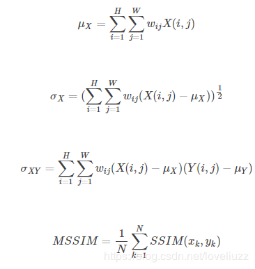

原文：https://blog.csdn.net/zjyruobing/article/details/49908979 

## **1.PSNR（Peak Signal to Noise Ratio）峰值信噪比：**


 MSE表示当前图像X和参考图像Y的均方误差（Mean Square Error），H、W分别为图像的高度和宽度；
 PSNR的单位是dB，数值越大表示失真越小。n为每像素的比特数，一般的灰度图像取8，即像素灰阶数为256. 

 PSNR是最普遍和使用最为广泛的一种图像客观评价指标，然而它是基于对应像素点间的误差，即基于误差敏感的图像质量评价。由于并未考虑到人眼的视觉特性（人眼对空间频率较低的对比差异敏感度较高，人眼对亮度对比差异的敏感度较色度高，人眼对一个区域的感知结果会受到其周围邻近区域的影响等），因而经常出现评价结果与人的主观感觉不一致的情况。
 Matlab的函数代码实现如下：

```
function [ out ] = psnr( X,Y )
[ m,n ] = size( X );
mse = sum(( double(X(:)) - double(Y(:)) ).^2);
mse = mse/(m*n);
out = 10*log10((255*255)/mse);
end
```

## **2.SSIM（Structural Similarity）结构相似性：**

μX、μY分别表示图像X和Y的均值，σX、σY分别表示图像X和Y的方差，σXY表示图像X和Y的协方差，即 ：


**SSIM**分别从亮度、对比度、结构三方面度量图像相似性。 


C1、C2、C3为常数，为了避免分母为0的情况，通常取C1=(K1∗L)2, C2=(K2∗L)2, C3=C22, 一般地K1=0.01, K2=0.03, L=255 则 


**SSIM**取值范围[0,1]，值越大，表示图像失真越小. 
**SSIM**的特殊形式如下：


## **3、MSSIM（Mean Structural Similarity ）平均结构相似性**

在实际应用中，可以利用滑动窗将图像分块，令分块总数为N，考虑到窗口形状对分块的影响，采用加权计算每一窗口的均值、方差以及协方差，权值wij满足∑i∑jwij=1,通常采用高斯核，然后计算对应块的结构相似度SSIM，最后将平均值作为两图像的结构相似性度量，即平均结构相似性MSSIM： 



**Matlab**的函数实现代码如下：

```
function [mssim, ssim_map] = ssim_index(img1, img2, K, window, L)
C1 = (K(1)*L)^2;
C2 = (K(2)*L)^2;
window = window/sum(sum(window));
img1 = double(img1);
img2 = double(img2);
 
mu1   = filter2(window, img1, 'valid');
mu2   = filter2(window, img2, 'valid');
mu1_sq = mu1.*mu1;
mu2_sq = mu2.*mu2;
mu1_mu2 = mu1.*mu2;
sigma1_sq = filter2(window, img1.*img1, 'valid') - mu1_sq;
sigma2_sq = filter2(window, img2.*img2, 'valid') - mu2_sq;
sigma12 = filter2(window, img1.*img2, 'valid') - mu1_mu2;
 
if (C1 > 0 & C2 > 0)
   ssim_map = ((2*mu1_mu2 + C1).*(2*sigma12 + C2))./((mu1_sq + mu2_sq + C1).*(sigma1_sq + sigma2_sq + C2));
else
   numerator1 = 2*mu1_mu2 + C1;
   numerator2 = 2*sigma12 + C2;
   denominator1 = mu1_sq + mu2_sq + C1;
   denominator2 = sigma1_sq + sigma2_sq + C2;
   ssim_map = ones(size(mu1));
   index = (denominator1.*denominator2 > 0);
   ssim_map(index) = (numerator1(index).*numerator2(index))./(denominator1(index).*denominator2(index));
   index = (denominator1 ~= 0) & (denominator2 == 0);
   ssim_map(index) = numerator1(index)./denominator1(index);
end
 
mssim = mean2(ssim_map);
 
return
```