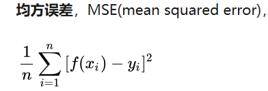

方法比较简单，自己能实现，不提供代码。但是速度上可能因为能力不同，有所不同。我用python-gpu实现的，速度很快，但是受限于gpu的内存大小。

# 1 方法一

## 平均哈希

1.图片缩放，一般为8*8，或者32*32

2.将图片灰度化

3.求平均值，并根据平均值将每一个像素二值化

4.将8*8=64位bit，每8个比特为一个十六进制值，转换成字符串，生成哈希值（指纹）

## 感知哈希

1.图片缩放 为32*32大小

2.将图片灰度化

3.对图片进行离散余弦变换（DCT），转换的频域

4.取频域左上角8*8大小（图片的能量都集中在低频部分，低频位于左上角）

5.计算平均值，并根据平均值二值化（同平均哈希）

6.生成哈希值

## 差异值哈希

1.图片缩放为9*8大小

2.将图片灰度化

3.差异值计算（每行相邻像素的差值，这样会生成8*8的差值，前一个像素大于后一个像素则为1，否则为0）

4.生成哈希值

**经过变化，最后计算两个图像的汉明距离，可以用于防止图像攻击人脸识别摄像头，**

# 方法二

## 均方误差

需要把图像缩放一定比例，为了排除某些细节对相似度的影响。可以做高斯模糊达到相同的效果，但是对计算量上考虑，缩放更加实用。

# 总结

还有更好的方法。当时没做笔记，忘了。

