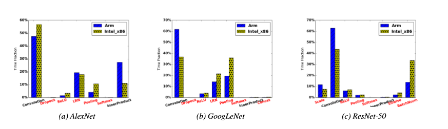
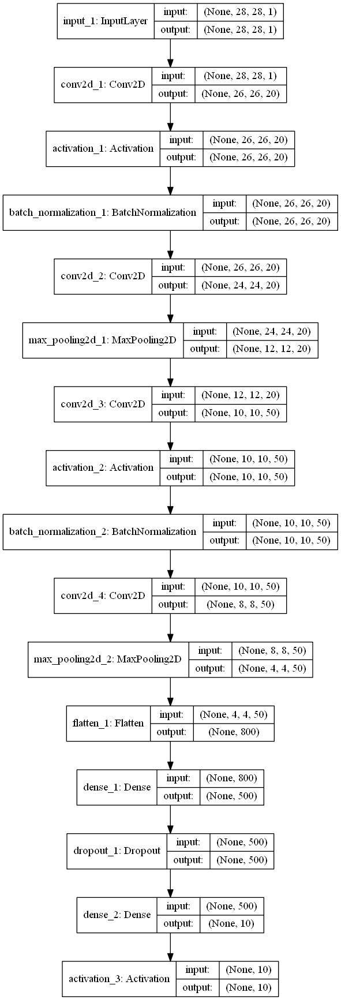
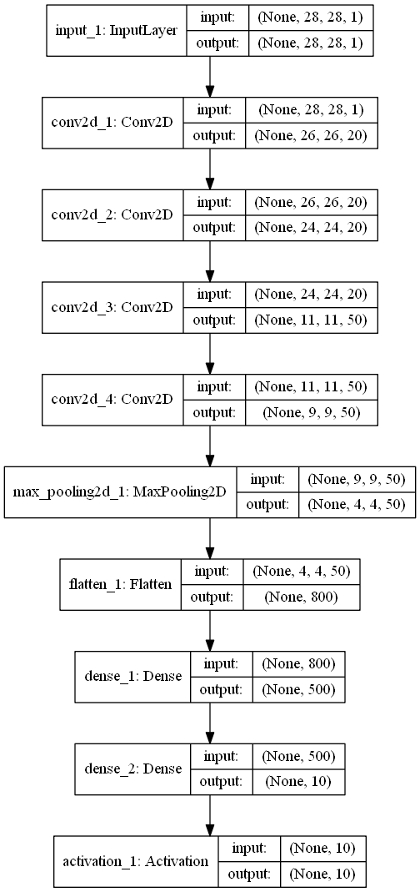
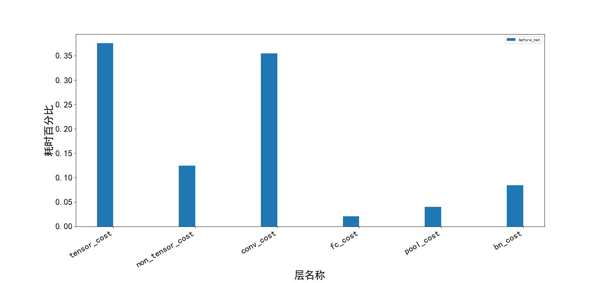
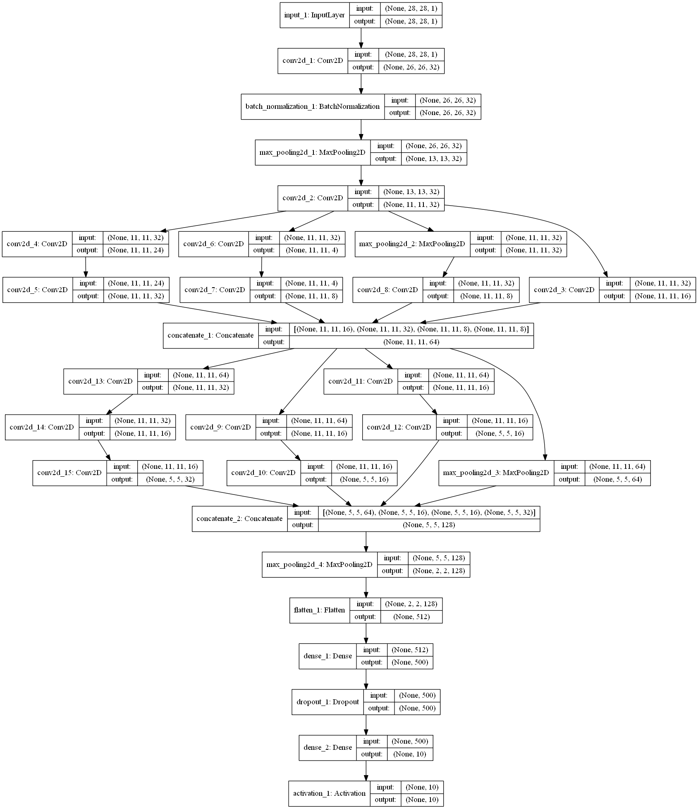
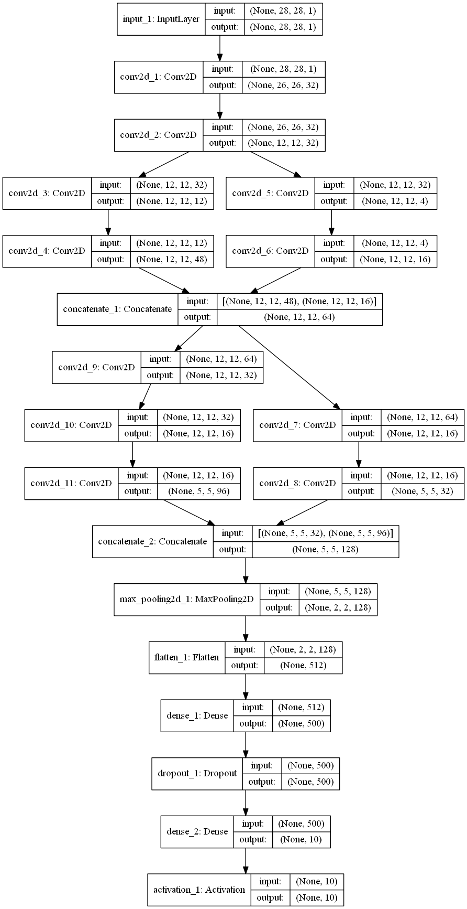
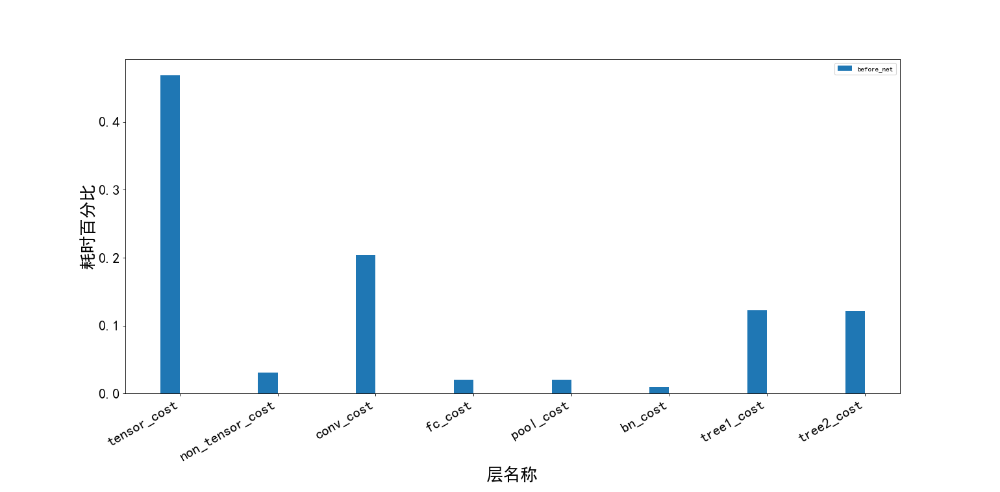
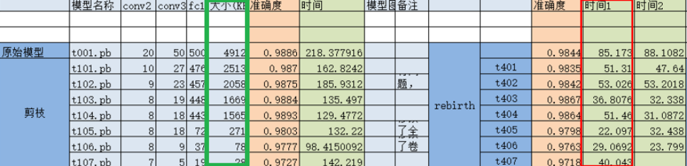

[TOC]


------

# 1 前言

## 1.1

由于个人时间和精力有限，训练的数据用的mnist，设计的都是简单网络。运行设备配置为i7 8代，16G内存，GT1070显卡的笔记本。

模型优化主要针对的是特征提取网络。目前现有的网络可以总结为四种网络结构：

- 深度型，例如 vgg，alexnet；
- 树形，例如 inception，resnet等；
- 密集型，Densenet；
- 特殊卷积方式，Depthwiseconv，ncnn等，例如mobilenet。

想了解特征网络的，可以看这个仓库[https://github.com/WhiteAzzan/Learn_net_not_html] ，里面包含了目前所有的25中特征提取网络。

网络中的层可以分为，向量计算：卷积，全连接，乘等等；非向量计算：池化，bn，拼接，激活函数等等。下图所示统计了非向量计算和向量计算耗时。观察下图可以发现，非向量计算在推断耗时中占了很大一比例。



下面主要用到了如下的优化方法。

非向量层融合：把非向量计算层，融合到向量计算层，不会改变模型的精度。不需要retrain。目的是减少计算时间。

树型中非向量层融合：该方法主要用于4个分支的树形结构，把非向量计算分支，融合到向量计算分支。需要retrain。目的是减少计算量。

通道剪枝：通过对当前层和上一层计算信息熵，来判断当前层某个featuremap的重要性，来选择是否舍弃。需要retrain。目的是减少计算参数，来达到加速。并不是参数越少计算越快。

全连接层低质分解：我用的是最简单的svd。需要retrain。减少了计算量。

量化：量化采用的是整数，非对称量化。手动量化比较麻烦，用的是tf自带的方法。需要retrain。目的是减小模型体积和加速。

## 1.2

下面给出vgg，tree，densenet结构优化的过程。

vgg使用如下流程：

(1)  剪枝-retrain；

(2)  全连接层低质分解-retrain

(3)  非张量层融合；

(4)  量化--int8 /轻量化。

tree使用如下流程：

(1)  逐tree结构融合-逐个retrain：最小二乘法/回归；

(2)  对非tree结构进行通道剪枝；

(3)  非张量层融合；

(4) 量化--int8 /轻量化。

densenet使用如下流程：

他的流程和vgg方法很像，也是通过当前层和前一层的关系来确定。后面没给出结果。


上面内容都来源于几篇论文，我用了3个月才找到最实用的方法。所以下面只有结果，不提供代码。

# 2 示例

## 2.1 vgg

这里方法主要指的线性深度网络，可以通用，比如vgg之流。

### 2.1.1 原始结构图

说是vgg，其实还不是，只是小的深度模型。




### 2.1.2 处理后后结构图

这个图为最终优化结果图。



 说明，关于`处理后后结构图`中的feature-map个数是不对的。修改后，远远低于此，这里只是为了演示结构图。结构图用keras-tool画的，而实现代码用的是tensorflow。 

### 2.1.3 优化前网络各层耗时比



*其中：*

- *tensor_cost为向量操作耗费总时间，non_tensor_cost为非向量操作耗费总时间；*
- *conv_cost，fc_cost，pool_cost，bn_cost分别为卷积，全连接，池化，正则化消耗时间。*

通过上图可以发现，非向量计算(non_tensor_cost)耗时占了很大一部分比例，其中正则化层再用时间最多。把非向量计算融合到向量计算种，以及对向量层剪枝，是优化的必做两种方法。全连接中有大量参数，可以用低质分解来加速，这里需要自己写量化方法了。


### 2.1.4 预测图片耗时比

以下结果为预测20次，计算2~20次预测耗时的平均值。演示代码。

|             | 优化前模型            | 优化后模型            | 比例(优化前/优化后) |
| ----------- | --------------------- | --------------------- | ------------------- |
| 速度(秒)    | 0.0010088002971439722 | 0.0006894601848655808 | 1.463               |
| 准确率(%)   | 0.9731                | 0.9731                | 1.0                 |
| 模型体积(k) | 1731.4638671875       | 32.640625             | 52.4                |
| 参数量      | 440,930               | 142,762               | 3.08                |

可能层太少了吧，速度提升并不明显，在vgg16测试过，提升速度将近4倍。量化后，模型预测速度降低了。

### 2.1.5 训练过程收敛曲线

数据复杂度比较小，两者收敛都比较快。如果在大数据上，剪枝后retrain收敛应该比原网络较快，同时容易训练不收敛。

## 2.2 tree

tree结构说的是inception结构，short-cut可理解为tree结构的特例。可是对任意中inception块处理。下图用的是inception_a和inception_c。

### 2.2.1 原始结构图



### 2.2.2 处理后后结构图



**–>  说明，关于`处理后后结构图`中的feature-map个数不对的。修改后，远远低于此，这里只是为了演示结构图。结构图用keras-tool画的，而实现代码用的是tensorflow。  <-–**

### 2.2.3 优化前网络各网络个层耗时比



*其中：*

- *tensor_cost为向量操作耗费总时间，non_tensor_cost为非向量操作耗费总时间；*
- *conv_cost，fc_cost，pool_cost，bn_cost，tree1_cost，tree2_cost分别为卷积，全连接，池化，正则化消耗时间，conv_cost和pool_cost不包括tree1_cost，tree2_cost的层。*

看上图，这个模型中的向量计算比vgg的多，所以耗时站的比例多。剪枝/蒸馏法可以很好的提升向量计算。有4个分线的tree结构（inception_a）可以通过合并分支来提升速度。每个分支都可以做剪枝处理，我这里分支的feature map个数太小了，不能做剪枝。

### 2.2.4 预测图片耗时比

以下结果为预测20次，计算2~20次预测耗时的平均值。演示代码。

|             | 优化前模型            | 优化后模型            | 比例(优化前/优化后) |
| ----------- | --------------------- | --------------------- | ------------------- |
| 速度(秒)    | 0.0029560850712961567 | 0.0012447643998629583 | 2.375               |
| 准确率(%)   | 98.3                  | 98.3                  | -                   |
| 模型体积(k) | 1180.5478515625       | 249.8203125           | 4.724               |
| 参数量      | 304,758               | 87,042                | 3.51                |

### 2.2.5 训练过程收敛曲线

数据复杂度比较小，两者收敛都比较快。如果在大数据上，剪枝后retrain收敛应该比原网络较快，同时容易训练不收敛。

## 2.3 密集型，Densene

### 流程

其结构中存在大量卷积运算和卷积拼接，一般处理这两种方法为，通道剪枝和feature map间的池化+retrain。能达到论文作者提到的改进方法效果。他的流程同深度的类似。


# 3 为什么通道剪枝后速度慢了？

下面是一个剪枝后测试图。随着剪枝的增加，模型体积明显变小了（绿框），但是速度有的变慢了（红框）。我理解是模型太小了，运行速度有个瓶颈。比如batch_size如果选着2或者4，你会发现模型的运行速度差不多。下面用一个vgg16做个测试。




# 4 vgg16


用的floawers数据集，跑了1圈。运行环境 vmare+ubuntu18.04+cpu+4G内存。目的是说明数据慢问题。

|              | 原始vgg16           | 优化后vgg16         | 原始vgg16/优化后vgg16 |
| ------------ | ------------------- | ------------------- | --------------------- |
| 体积(k)      | 524547k             | 22003k              | 23.8                  |
| 评估耗时(秒) | 0.22061001627068771 | 0.06133817672729492 | 3.5                   |

模型量化后速度提升在2-3之间，加上剪枝和低质分解对模型的提升提升，差不多3.5的结果。

# 5 卷积代替全连接

今天做压缩问题，需要把maxpool融合到fc中，直接做是不可能的。这时候我想到了用conv代替fc，maxpool融合到conv中，这样可以融合。这时候问题出现了。参数量增加。

下面是个例子，输入为$[-1,4,4,96]$的数据，输出为$[-1,500]$。

未融合时的参数量

```
max_pooling2d_5 (MaxPooling2D)  (None, 2, 2, 96)     0           concatenate_4[0][0]  
__________________________________________________________________________________________________

flatten_2 (Flatten)             (None, 384)          0           max_pooling2d_5[0][0]            
__________________________________________________________________________________________________

dense_3 (Dense)                 (None, 500)          192500      flatten_2[0][0]  
```

融合后的参数量

```
conv2d_27 (Conv2D)              (None, 1, 1, 500)    1200500     concatenate_4[0][0]  
```

参数量增加了6.2倍，这个真的很恐怖，我统计了下pool和flatten耗时并不太多。这里就放弃了融合。

~~conv代替fc，这个好像只是进入大厂的一个考题，应用并不太理想。~~ 


# 附录

## 4d conv –> 2d conv

会用到如下的代码，4d映射为2d卷积：

```python
import cupy as cp

d4 = cp.linspace(1, 1000, 1000).reshape(10, 4, 5, 5)  # [N,C,d,d]

def four_2_two(d4):
    N, C, d, _ = d4.shape
    d2 = cp.empty([d * N, d * C])
    def innrt(i1, i2, i3, i4, d):
        j1 = (i1 - 1) * d + i3
        j2 = (i2 - 1) * d + i4
        return j1, j2
    for i1 in range(N):
        for i2 in range(C):
            for i3 in range(d):
                for i4 in range(d):
                    j1, j2 = innrt(i1, i2, i3, i4, d)
                    d2[j1, j2] = d4[i1, i2, i3, i4]
    return d2

re_d2 =four_2_two(d4)
print(len(cp.unique(re_d2)))

def two_2_four(d2):
    h,w = d2.shape
    N, C, d, _ = (10, 4, 5, 5)
    d4 = cp.empty((10, 4, 5, 5))
    def innrt(i1, i2, i3, i4, d):
        j1 = (i1 - 1) * d + i3
        j2 = (i2 - 1) * d + i4
        return j1, j2
    for i1 in range(N):
        for i2 in range(C):
            for i3 in range(d):
                for i4 in range(d):
                    j1, j2 = innrt(i1, i2, i3, i4, d)
                    d4[i1, i2, i3, i4] = d2[j1, j2]
    return d4

re_d4= two_2_four(re_d2)
print(len(cp.unique(re_d4)))
```


## 特殊卷积方式，Depthwiseconv，ncnn等，例如mobilenet

这里一般是通过teacher-student蒸馏法方法来优化的，在找论文和学习中。